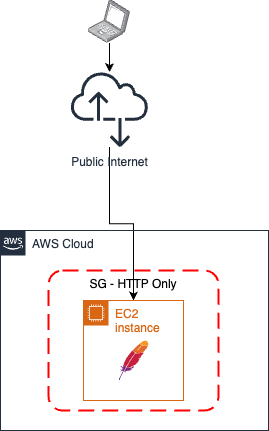

# Hello World Apache
This is the most basic example.

This example is creating a simple Ubuntu [EC2 machine](https://aws.amazon.com/pm/ec2), installing [Wordpress](https://en-au.wordpress.org/) on it and allowing remote connection on port 80, the http port, via a [AWS Security Group](https://docs.aws.amazon.com/vpc/latest/userguide/vpc-security-groups.html).
