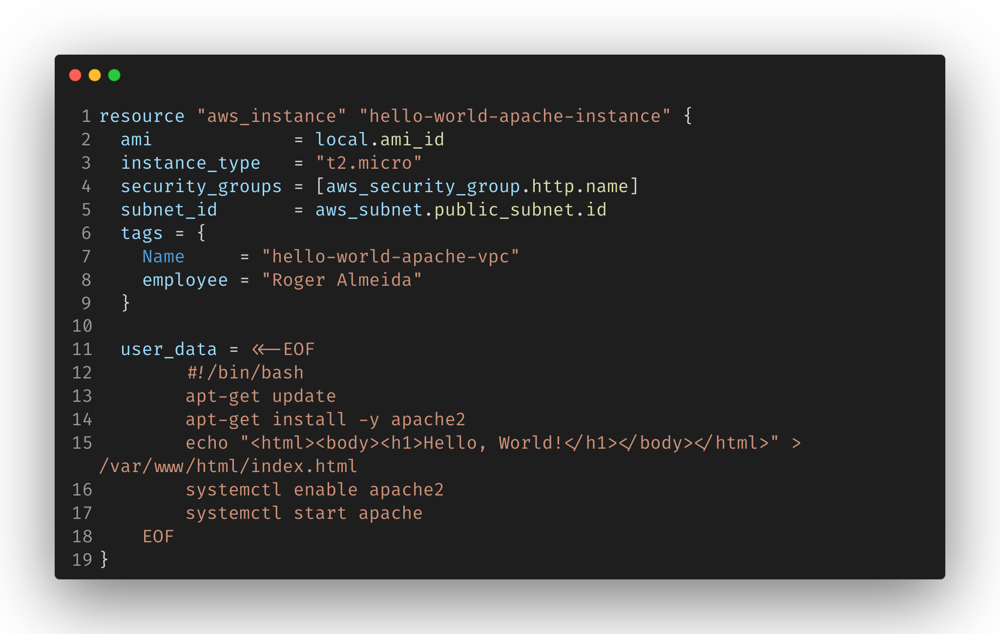

# Hello World Apache on VPC
On the previous example we were using the default VPC, which unless you are doing some small POC you should never use the default VPC.

> **Default VPC**:
My impression is that the Default VPC is targeted to people with no cloud experience, so it has some weird rules that you should never use on a real project. Even a side project.

## VPC
We are creating an [AWS VPC](https://docs.aws.amazon.com/vpc/) with the following configuration:
```ruby
resource "aws_vpc" "hello-world-apache-vpc" {
  cidr_block = "10.0.0.0/16"
  tags = {
    Name     = "hello-world-apache-vpc"
    employee = "Roger Almeida"
  }
}
```

The `cidr_block = "10.0.0.0/16"` supports up to a little short of 65,536 IPs inside our VPC. Remember that [some IP address are reserved by AWS](https://docs.aws.amazon.com/vpc/latest/userguide/subnet-sizing.html#subnet-sizing-ipv4).

### Subnets
For now we are creating only 1 subnet:
```ruby
resource "aws_subnet" "public_subnet" {
  vpc_id                  = aws_vpc.hello-world-apache-vpc.id
  cidr_block              = "10.0.1.0/24"
  availability_zone       = "ap-southeast-2a"
  map_public_ip_on_launch = true
  tags = {
    Name     = "hello-world-apache-vpc"
    employee = "Roger Almeida"
  }
}
```

* The Subnet is attached to our VPC via: `vpc_id = aws_vpc.hello-world-apache-vpc.id`.
* The CIDR `10.0.1.0/24` allows us to use up to 256 IPs.

### Public Internet Access
Since we are creating a custom VPC, it will be completly locked by default. So we have to create a [Internet Gateway](https://docs.aws.amazon.com/vpc/latest/userguide/VPC_Internet_Gateway.html) and create a [Route Table](https://docs.aws.amazon.com/vpc/latest/userguide/VPC_Route_Tables.html) to allow traffic going and coming from the public internet. This entry is created in terraform via the `aws_route_table_association` which associates the Route Table with the Subnet we have created.

```ruby
resource "aws_internet_gateway" "my_igw" {
  vpc_id = aws_vpc.hello-world-apache-vpc.id
  tags = {
    Name     = "hello-world-apache-vpc"
    employee = "Roger Almeida"
  }
}

resource "aws_route_table" "public_route_table" {
  vpc_id = aws_vpc.hello-world-apache-vpc.id

  route {
    cidr_block = "0.0.0.0/0"
    gateway_id = aws_internet_gateway.my_igw.id
  }
  tags = {
    Name     = "hello-world-apache-vpc"
    employee = "Roger Almeida"
  }
}

resource "aws_route_table_association" "public_subnet_association" {
  subnet_id      = aws_subnet.public_subnet.id
  route_table_id = aws_route_table.public_route_table.id
}
```

### Security Group
But the Internet Gateway is just the road to/from the public internet. We still have to allow connections to our web-server for http requests. For that we have to create a Security Group which allows connections to the port 80.
```ruby
resource "aws_security_group" "http" {
  name        = "http"
  description = "Allow inbound and outbound HTTP traffic"

  ingress {
    from_port   = 80
    to_port     = 80
    protocol    = "tcp"
    cidr_blocks = ["0.0.0.0/0"]
  }

  egress {
    from_port   = 0
    to_port     = 0
    protocol    = "-1"
    cidr_blocks = ["0.0.0.0/0"]
  }
  tags = {
    Name     = "hello-world-apache-vpc"
    employee = "Roger Almeida"
  }
}
```

## Web Server
Finally we have to create the Web Server as an EC2 machine:
```ruby
resource "aws_instance" "hello-world-apache-instance" {
  ami             = local.ami_id
  instance_type   = "t2.micro"
  security_groups = [aws_security_group.http.name]
  subnet_id       = aws_subnet.public_subnet.id
  tags = {
    Name     = "hello-world-apache-vpc"
    employee = "Roger Almeida"
  }

  user_data = <<-EOF
        #!/bin/bash
        apt-get update
        apt-get install -y apache2
        echo "<html><body><h1>Hello, World!</h1></body></html>" > /var/www/html/index.html
        systemctl enable apache2
        systemctl start apache2
    EOF
}
```
### Line by line explanation



- 1: The resource declaration
- 2: Declaring we are using the ami that the [ami-ubuntu](https://registry.terraform.io/modules/andreswebs/ami-ubuntu/aws/latest) provides
- 3: Declaring we want to instance to be of the type `t2.micro`
- 4: Informing that this instance should use the Security Group we created before
- 5: Declaring that this instance should exist inside the Subnet we created above
- 6-9: tags declaration
- 11-18: Declaring the [User Data](https://docs.aws.amazon.com/AWSEC2/latest/UserGuide/user-data.html) commands that should be executed when the instance is launched.
    - 12: [Bash shebang](https://en.wikipedia.org/wiki/Shebang_(Unix))
    - 13: updating `apt-get` before installing new software
    - 14: Installing [Apache](https://httpd.apache.org/)
    - 15: This line is creating an index.html page with the text `Hello, World!`
    - 16: Enabling the Apache web-server service
    - 17: Starting the Apache web-server service
