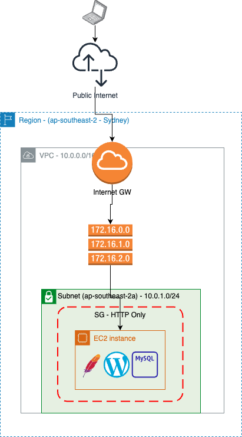

# Enter Wordpress



This example replaces the previous server with a worpress AND mysql installation.

## Installing the required software
There is quite a bit of software required to be installed for this example to work. The user data for the EC2 resource is:

```shell
    #!/bin/bash
    apt-get update
    apt-get install -y apache2
    apt-get install -y mysql-server
    apt-get install -y php libapache2-mod-php php-mysql
    apt-get install -y php-curl php-gd php-mbstring php-xml php-xmlrpc php-soap php-intl php-zip
    systemctl enable apache2
    systemctl start apache2
    systemctl enable mysql
    systemctl start mysql

    # Set password with `debconf-set-selections` You don't have to enter it in prompt
    debconf-set-selections <<< "mysql-server mysql-server/root_password password secret" # new password for the MySQL root user
    debconf-set-selections <<< "mysql-server mysql-server/root_password_again password secret" # repeat password for the MySQL root user

    # Other Code.....
    mysql --user=root --password=secret << EOFMYSQLSECURE
      DELETE FROM mysql.user WHERE User='root' AND Host NOT IN ('localhost', '127.0.0.1', '::1');
      DELETE FROM mysql.user WHERE User='';
      DELETE FROM mysql.db WHERE Db='test' OR Db='test_%';
      CREATE DATABASE wordpress;
      CREATE USER wordpress@localhost IDENTIFIED BY 'secret';
      GRANT SELECT,INSERT,UPDATE,DELETE,CREATE,DROP,ALTER ON wordpress.* TO wordpress@localhost;
      FLUSH PRIVILEGES;
    EOFMYSQLSECURE

    # Note down this password. Else you will lose it and you may have to reset the admin password in mySQL
    echo -e "SUCCESS! MySQL password is: secret"

    wget https://wordpress.org/latest.tar.gz
    tar -xzf latest.tar.gz
    cp -R wordpress/* /var/www/html/
    chown -R www-data:www-data /var/www/html/
```

This is installing both WordPress and MySQL on the one server we are using.

## Facilitating trouble shooting
To be able to trouble shoot this instance, I have created a security key pair that I can use to ssh into the machine.

```ruby
resource "aws_key_pair" "existing-m1-kp" {
  public_key = file("./m1-kp.pub")
}
```
> ⚠️ Note: it is better to enable SSM on the account and use ssm to connect to the machine

>🙈 Git is ignoring the pub files 