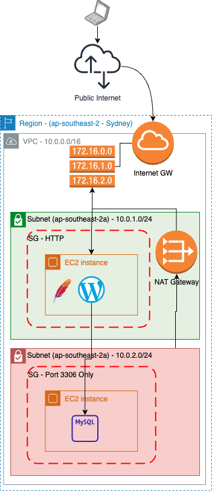

# 004: Wordpress with DB on a private subnet



## Necessary networking config
The EC2 instance in the private subnet doesn't have a way to download and install MySql directly.

In order for it to work we have to create a [NAT Gateway](https://docs.aws.amazon.com/vpc/latest/userguide/vpc-nat-gateway.html) in the public subnet and add an entry to the [Route Table](https://docs.aws.amazon.com/vpc/latest/userguide/VPC_Route_Tables.html) to allow instances in the private subnet to have a route to the internet.

In the terraform this is done with the following resources:

```ruby
resource "aws_nat_gateway" "nat_gateway" {
  allocation_id = aws_eip.nat_eip.id
  subnet_id     = aws_subnet.public_subnet.id

  tags = {
    Name     = "wordpress-nat-gateway"
    employee = "Roger Almeida"
  }

  # To ensure proper ordering, it is recommended to add an explicit dependency
  # on the Internet Gateway for the VPC.
  depends_on = [aws_internet_gateway.my_igw]
}
```

>Note: The `aws_nat_gateway` requires a `allocation_id` which comes from a `aws_eip` [AWS Elastic IP](https://docs.aws.amazon.com/AWSEC2/latest/UserGuide/elastic-ip-addresses-eip.html)

```ruby
resource "aws_eip" "nat_eip" {
  domain = "vpc"
  depends_on = [ aws_internet_gateway.my_igw ]
  tags = {
    Name     = "wordpress-eip"
    employee = "Roger Almeida"
  }
}
```

The Route Table will need then an entry to map requests coming from the private subnet to the public internet via the NAT Gateway that seats on the Public Subnet.

```ruby
resource "aws_route_table" "private_route_table" {

  vpc_id = aws_vpc.wordpress-apache-vpc.id

  route {
    # cidr_block     = aws_subnet.private_subnet.cidr_block
    cidr_block =  "0.0.0.0/0"
    nat_gateway_id = aws_nat_gateway.nat_gateway.id
  }
  tags = {
    Name     = "wordpress-private-route-table"
    employee = "Roger Almeida"
  }

}

resource "aws_route_table_association" "private_subnet_association" {
  subnet_id      = aws_subnet.private_subnet.id
  route_table_id = aws_route_table.private_route_table.id
}
```

## Ordering matters
Terraform is smart enough to understand when a resource makes a reference to another resource and it creates the resource in the right order.

But it cannot understand when a resource doesn't depend directly on another resource, but if you create them in the wrong order our system might not behave in the expected way. An example of that is our dependency on the NAT Gateway and Routing Tables to be able to install the required software on the EC2 instances.

In this case it is safer to explicitly force the dependency between the "unrelated" resources:

```ruby
resource "aws_instance" "wordpress-db-server" {
  ami                    = local.ami_id
  instance_type          = "t2.micro"
  subnet_id              = aws_subnet.private_subnet.id
  vpc_security_group_ids = [aws_security_group.mysql.id, aws_security_group.icmp.id]
  key_name               = aws_key_pair.existing-m1-kp.key_name
  user_data              = <<-EOF
    ...
  EOF

  # Forcing the creation of the database instances only after the creation of the NAT Gateway
  depends_on = [ aws_nat_gateway.nat_gateway ]
  tags = {
    Name     = "wordpress-db-server"
    employee = "Roger Almeida"
  }
}
```

## Manual step
[MySQL](https://www.mysql.com/) will block any attempt to connection coming from a machine that is not the database server.
So to be able to stabelish the connection between the Web Server and the Database it is necessary to manually connect to the database server via [AWS System Manager](https://docs.aws.amazon.com/systems-manager/latest/userguide/what-is-systems-manager.html) and edit the `/etc/mysql/mysql.conf.d/mysqld.cnf` file, changin the `bind-address` from `127.0.0.1` to `0.0.0.0`. Reference: https://www.digitalocean.com/community/tutorials/how-to-allow-remote-access-to-mysql